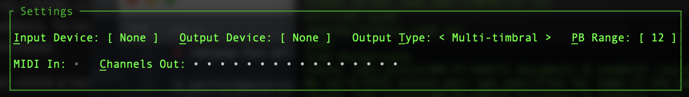
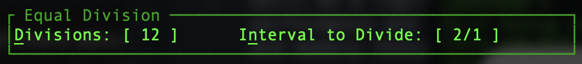
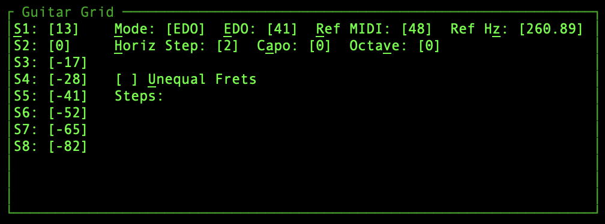
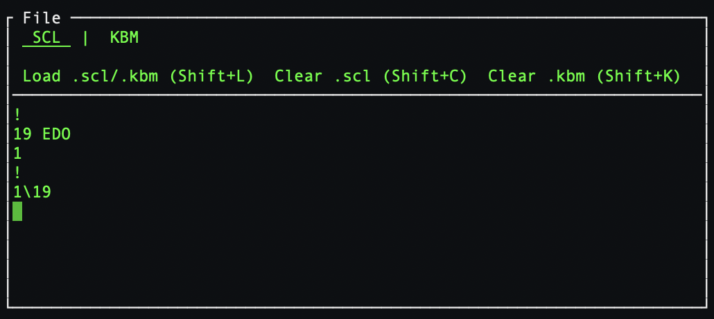

# retune-for-all

Retune for All is a performance-oriented microtonal MIDI retuner that can send multi-timbral or MPE MIDI, supports Scala `.scl`/`.kbm` file import, and reads & writes YAML presets.

Built as a lightweight, lightning-fast **Terminal User Interface (TUI)**, `retune-for-all` is optimized for live performance and deep tuning exploration. Quickly set up the TUI using hotkeys, import and tweak scl/kbm files, and save/load presets.

Because RfA runs bare-metal with a tiny CPU and memory footprint, you can easily run multiple instances simultaneously to manage many independent retuned MIDI routings at once.

---

## Getting Started

### Download Prebuilt Binaries (Recommended)
We use `cargo-dist` to automatically build optimized executables for all major platforms. 
1. Navigate to the **Releases** tab on the right side of this GitHub page.
2. Download the packaged zip/tarball corresponding to your operating system (Windows, macOS, or Linux).
3. Extract the archive and run the executable directly from your terminal!

### Install via Cargo (Rust Toolchain)
If you prefer to compile from source using Rust:
```bash
cargo install retune-for-all

```

> 🐧 **Linux Users:** Make sure you have the ALSA development headers installed before compiling: `sudo apt install libasound2-dev`
(or similar os specific tools)

---

## Keyboard Navigation & Setup

The interface is built to behave like a fast, interactive spreadsheet. Every parameter is mapped to a hotkey (indicated by underlined letters or highlighted brackets). Pressing the hotkey shifts focus to that parameter, and `Enter` is used to enter/exit data entry intuitively. Arrow keys also navigate as expected.


### **I**nput / **O**utput Setup

* Press `i` to focus **Input Device** or `o` to focus **Output Device**.
* Press `Enter` to open an interactive drop-down menu of available system MIDI ports.
* Use the **Up/Down Arrows** or type the index number to select a port, then press `Enter` to bind the connection.

#### Output **T**ype

* Press `t`,`Enter` to toggle between **Multi-Timbral** and **MPE** output.

#### Selecting Output **C**hannels

* Press `c` to jump into the **Channels Out** matrix.
* Use **Left/Right Arrows** to highlight a channel dot (`•`), and use `Enter` to toggle a channel active or inactive. *(Note: In MPE mode, Channel 1 is preserved as the Master channel).*

---

## Tuning Modules

`retune-for-all` features three distinct tuning engines:

### 1. Equal Division


* **Hotkeys:** `d` (Divisions) / `n` (Interval to Divide)
* Divides a target macro-interval (such as an octave `2/1`, a tritave `3/1`, or a 12edo major third `4\12`) into a set number of equal steps. Press `Enter` to edit, type your value, and hit `Enter` to apply.

### 2. Guitar Grid

Perfect for isometric MIDI layouts, launchpads, or fretboard controllers, this mode lays out pitch structures across strings (rows) and frets (columns). 

_Note: This mapping currently assumes MIDI note 0 is at the top left of the grid controller, 16 is one row down, and notes increment by one each button to the right._

* **Open Strings (`S1` - `S8`):** Press `s` to jump to the string array. Press `Enter`, type your offset from the reference pitch, hit `Enter`, repeat. These define the notes of the far left column.
* **EDO vs. JI Mode:** Press `m`,`Enter` to toggle. **EDO Mode** calculates standard linear steps of a given Equal Division of the Octave, while **JI Mode** accepts ratios (or any valid scl line).
    * In **EDO** mode, 0 maps to the reference note
    * In **JI** mode, 1/1 maps to the reference note. 
* **Equal vs. Unequal Frets:** Press `u`,`Enter` to toggle custom fret sizes.
    * *Horiz Step:* Sets the equal interval all notes increase by each step to the right.
    * *Unequal Frets:* Displays a grid of individual columns allowing you to assign a unique, independent interval value to every specific fret step. 
        * In **EDO mode**, unequal steps name the number of EDO steps from one button to the next 
        * In **JI mode**, entries specify ratios above the open string for each button to the right of the open strings

### 3. File Import & Live Notepad

* **Hotkeys:** `f`,`Enter` to enter typing mode inside the scratchpad, and `Tab` to switch between the SCL and KBM notepads. Press `Shift + L` to quickly load external files (you may drag and drop files into the terminal screen or paste the full path to the file)
* **Format Standards:** Fully supports the official format architectures of the [Scala Scale (.scl) Specification](https://www.huygens-fokker.org/scala/scl_format.html) and [Keyboard Mapping (.kbm) Specification](https://www.huygens-fokker.org/scala/help.htm#mappings).
    * Note that one additional convenience interval style can be used beyond scl standards: `n` steps of `m` EDO can be written `n\m`
* **On-The-Fly Editing:** You can write or edit Scala text fields natively in the File panel. Pressing `Enter` on a row instantly updates the scale structure and retunes active hardware channels. Press `Esc` to safely exit the editor.

---

## Saving & Loading Presets

Your configurations are written directly into a human-readable local configuration file (`presets.yml`) for easy editing.

* 📁 **Load Preset:** Press `Shift + P`, then tap a number key `1` through `9`.
* 💾 **Save Preset:** Press `Shift + S`, then tap a number key `1` through `9` to instantly snapshot your routing layout, hardware channels, and macro tuning formulas.

---

## 📄 License

This project is open-source and licensed under the terms of the **MIT License**. You are free to modify, distribute, and utilize this software in any personal or commercial derivative work provided attribution is maintained.

